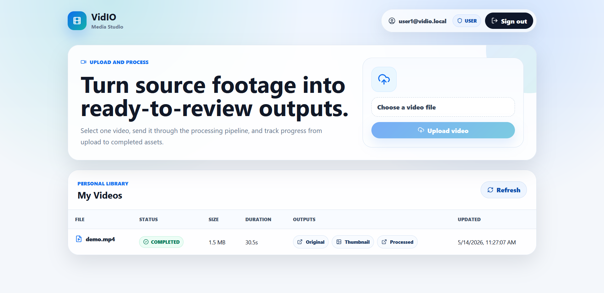
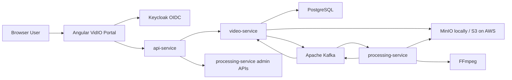

# VidIO

[](https://vidio.md-dev970.com)




Live app: [vidio.md-dev970.com](https://vidio.md-dev970.com)

API host: [api.vidio.md-dev970.com](https://api.vidio.md-dev970.com/health)

VidIO is a full-stack video processing platform built as Spring Boot microservices. Authenticated users upload videos through a modern Angular portal, originals are stored in S3-compatible storage, Kafka coordinates asynchronous FFmpeg processing, and users receive owner-scoped access to originals, thumbnails, and processed outputs through short-lived presigned URLs.

Admins get an operational view of all videos, processing jobs, and aggregate status counts without bypassing the same authenticated API layer.

## What It Does

- User signup and login through Keycloak/OIDC.
- User-owned video uploads with `100MB` request limits.
- Owner isolation: users can list and open only their own videos.
- Admin visibility across all videos, jobs, owners, and processing status.
- Asynchronous processing with Kafka and FFmpeg.
- Thumbnail generation plus 720p MP4 output creation.
- S3-compatible object storage:
  - MinIO for local Docker/Kubernetes development.
  - AWS S3 for the deployed EKS environment.
- Short-lived presigned URLs for original, thumbnail, and processed assets.
- Angular Media Studio portal for uploads, status tracking, and admin monitoring.
- Docker Compose for local development.
- Kubernetes manifests for Docker Desktop and AWS EKS.
- Terraform-managed AWS dev infrastructure and GitHub Actions CI/CD.

## Architecture



VidIO keeps the public surface small. The browser talks to `api-service`, which validates JWTs and forwards the original `Authorization` header to downstream services. `video-service` owns video metadata, ownership rules, upload handling, and processing result consumers. `processing-service` owns FFmpeg execution and job tracking.

Video uploads are stored as object keys, not shared filesystem paths:

```text
original/{videoId}.mp4
thumbnails/{videoId}.jpg
processed/{videoId}_720p.mp4
```

Kafka topics carry those object keys between services:

- `video.uploaded`
- `video.processing.completed`
- `video.processing.failed`

## Runtime Components

| Component | Local port | Responsibility |
| --- | ---: | --- |
| `admin-dashboard` | `8088` | Angular Media Studio portal for users and admins |
| `api-service` | `8081` | Public API gateway, JWT validation, admin route protection, downstream proxy |
| `video-service` | `8082` | Video metadata, owner filtering, uploads, presigned URLs, processing event consumers |
| `processing-service` | `8083` | Kafka worker, processing job APIs, FFmpeg thumbnail/output generation |
| `keycloak` | `8089` | OIDC identity provider, signup, email verification, roles |
| `postgres` | `5432` | Video and processing job persistence |
| `kafka` | `9092` | Single-node Apache Kafka in KRaft mode |
| `kafka-ui` | `8085` | Local Kafka inspection |
| `minio` | `9000`, `9001` | Local S3-compatible object store and console |
| `mailpit` | `8025`, `1025` | Local email inbox and SMTP server |

## Local Development

Start the full local stack:

```powershell
docker compose up --build
```

Useful local URLs:

| Service | URL |
| --- | --- |
| VidIO portal | `http://localhost:8088` |
| API health | `http://localhost:8081/health` |
| Keycloak | `http://localhost:8089` |
| Kafka UI | `http://localhost:8085` |
| MinIO console | `http://localhost:9001` |
| Mailpit | `http://localhost:8025` |

Local demo accounts are seeded for development only:

| Username | Password | Roles |
| --- | --- | --- |
| `admin` | `admin123` | `USER`, `ADMIN` |
| `user1` | `user123` | `USER` |
| `user2` | `user123` | `USER` |

MinIO local credentials are `minioadmin` / `minioadmin`.

Self-registration is enabled. In Docker Compose, verification emails are delivered to Mailpit. In AWS, Keycloak is configured to use Brevo SMTP through GitHub environment secrets and Kubernetes secrets.

## API Smoke Test

Get a user token:

```powershell
$token = (curl.exe -s -X POST "http://localhost:8089/realms/vidio/protocol/openid-connect/token" -H "Content-Type: application/x-www-form-urlencoded" -d "client_id=vidio-dashboard" -d "username=user1" -d "password=user123" -d "grant_type=password" | ConvertFrom-Json).access_token
```

Upload a video:

```powershell
curl.exe -v -H "Authorization: Bearer $token" http://localhost:8081/api/videos -F "file=@`"C:\Users\md\Downloads\demo.mp4`";type=video/mp4"
```

List owned videos:

```powershell
curl.exe -H "Authorization: Bearer $token" http://localhost:8081/api/videos
```

Open an owned asset through a fresh presigned URL:

```powershell
$asset = curl.exe -s -H "Authorization: Bearer $token" http://localhost:8081/api/videos/{id}/assets/original/url | ConvertFrom-Json
Start-Process $asset.url
```

Admin overview:

```powershell
$adminToken = (curl.exe -s -X POST "http://localhost:8089/realms/vidio/protocol/openid-connect/token" -H "Content-Type: application/x-www-form-urlencoded" -d "client_id=vidio-dashboard" -d "username=admin" -d "password=admin123" -d "grant_type=password" | ConvertFrom-Json).access_token
curl.exe -H "Authorization: Bearer $adminToken" http://localhost:8081/api/admin/overview
```

## Deployment

VidIO is deployed on AWS as:

- Angular portal, API, video service, processing service, Keycloak, Postgres, and Kafka running on EKS.
- Private S3 bucket for original videos, thumbnails, and processed outputs.
- ALB ingress for `vidio.md-dev970.com` and `api.vidio.md-dev970.com`.
- Route 53 delegated hosted zone for the VidIO subdomain.
- Brevo SMTP for Keycloak email verification.
- GitHub Actions with OIDC-based AWS role assumption and approved `dev` deployments.
- Terraform remote state in S3 with DynamoDB locking.

The deployment is intentionally a cost-conscious MVP: Postgres, Kafka, and Keycloak run in-cluster rather than using RDS/MSK or an external identity provider.

## Validation

Backend tests:

```powershell
cd new-services/api-service
mvn test
cd ..\video-service
mvn test
cd ..\processing-service
mvn test
```

Frontend and image checks:

```powershell
docker compose build admin-dashboard
docker compose build api-service video-service processing-service
```

Infrastructure checks:

```powershell
terraform fmt -check -recursive infrastructure/terraform
terraform -chdir=infrastructure/terraform/envs/dev validate
kubectl kustomize k8s/aws
```

## Documentation

- [Architecture](docs/architecture.md)
- [API reference](docs/api.md)
- [Kafka events](docs/kafka-events.md)
- [Docker Desktop Kubernetes](docs/kubernetes.md)
- [AWS deployment guide](docs/aws-deployment.md)
- [CI/CD and Terraform bootstrap](docs/cicd.md)

## Secret Hygiene

- Real `terraform.tfvars`, Terraform state, Kubernetes runtime config, and AWS Kubernetes config files are ignored.
- Commit examples only:
  - `k8s/config.example.yaml`
  - `k8s/aws/config.example.yaml`
  - `terraform.tfvars.example`
- Local demo credentials in Docker Compose and Keycloak realm imports are development-only placeholders, not production secrets.
